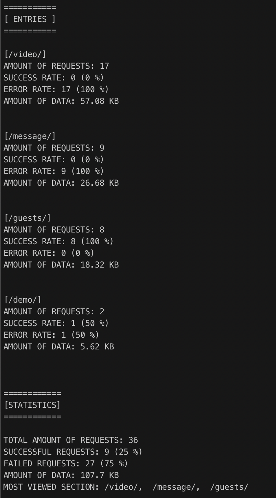

# nodejs-http-traffic-monitor

A simple console program that monitors HTTP traffic on your machine.
It consumes an actively written-to [w3c-formatted](https://www.w3.org/Daemon/User/Config/Logging.html) HTTP access log.

```
127.0.0.1 - james [09/May/2018:16:00:39 +0000] "GET /report HTTP/1.0" 200 1234
127.0.0.1 - jill [09/May/2018:16:00:41 +0000] "GET /api/user HTTP/1.0" 200 1234
127.0.0.1 - frank [09/May/2018:16:00:42 +0000] "GET /api/user HTTP/1.0" 200 1234
127.0.0.1 - mary [09/May/2018:16:00:42 +0000] "GET /api/user HTTP/1.0" 200 1234
```

## Installation

This project requires Node.js version >= 12.X.X

Installation

```
npm install
```

or

```
yarn install
```

## Usage

By default, the program will try to read `/tmp/access.log`

```
npm run start
```

You can precise which file the program should read thanks to the `-f` or `--file` flag.

```
npm run start -f path_to_logfile
```

A demo is also available through the `-d` or `--demo` flag. It will read an `access.log` file present in the `logs` folder.

```
npm run start --demo
```

The program displays new http requests every `10` seconds in the file.
In addition to displaying the logs of the file, the program also displays a summary of the last data retrieved.

 "Output example")

The period during which the program reads the log file can be modified in the `.env` file at the root of the project (`PERIOD` variable).
